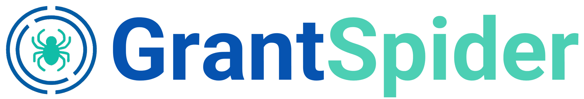

<p align="center">
  
</p>

<h2 align="center">🕷️ Conversational Multi-Agent Chatbot</h2>

<p align="center">
  <em>A tech interview challenge for exploring an agentic retrieval solution for Grant QA</em>
</p>

<p align="center">
  <a href="https://www.python.org/downloads/">
    
  </a>
  <a href="https://python.langchain.com/docs/langgraph/">
    
  </a>
  <a href="https://www.gradio.app/">
    
  </a>
  <a href="https://huggingface.co/">
    
  </a>
  <a href="https://groq.com/">
    
  </a>
</p>

---

## 🧰 Project Structure

This repository is divided into two key modules:

### 1. **Preprocessing**
- Handles **text layout analysis** and **paragraph segmentation**.
- Transforms raw documents into structured, clean input for RAG.

### 2. **RAG (Retrieval-Augmented Generation)**
- Implements an **agentic RAG pipeline** using [LangGraph](https://python.langchain.com/docs/langgraph/).
- Two interfaces available:
  - ✅ Command-line script
  - 🌐 Gradio web interface

---

## 🚀 Getting Started

Clone the repository and install dependencies:

```bash
git clone --recurse-submodules git@github.com:vcolamatteo/GrantSpider.git
cd GrantSpyder
pip install uv
